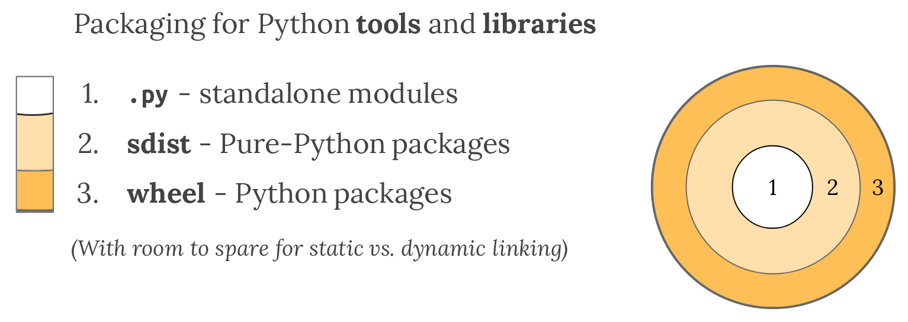

# Py RESTful
Como diseñar APIs REST con Python, desde cero – Parte 1

## Introducción
Actualmente en la compañía el workflow (flujo de trabajo) que tenemos a la hora de crear aplicaciones Python es menos que ideal, creamos nuestros módulos .py y nuestro archivo requirementes.txt y nos desentendemos del proceso de despliegue.

Pero esté estilo de trabajo requiere que la persona encargada del despliegue tenga por obligación que entender de Python, para que pueda instalar la versión de Python adecuada y las dependencias, e incluso no tenemos en cuenta fijar una versión de Python en los metadatos de nuestras aplicaciones abriendo la posibilidad a incompatibilidades.

En palabras de la [Python Packaging Authority](https://packaging.python.org/overview/#python-modules) 
> El patrón de la utilización de modulos _.py_ de python como medio para distribuir proyectos no es escalable para proyectos que consistan de multitudes de ficheros, necesiten librerias adicionales o requieran una versión especifica de python.

## Empaquetando

> El empaquetamiento se puede entender como el arte producir un artefacto contenido para la transferencia y uso confiable en ambientes productivos - [The Packaging Gradient](https://www.youtube.com/watch?v=iLVNWfPWAC8)


A la hora de distribuir nuestros artefactos tenemos muchas alternativas dependiendo de el nivel de portabilidad que queramos tener, es posible utilizar cualquiera de las estrategias mencionadas en [The Packaging Gradient](https://www.youtube.com/watch?v=iLVNWfPWAC8)




Y se debe escoger la que mejor se ajuste a nuestras necesidades.

## PyPI & PyPa
La __PyPa__ (Python Packaging Authority) publica constantemente una guía de empaquetado de aplicaciones pyton en packaging.python.com, ellos son quienes documentan el proceso ideal de empaquetamiento y son quienes administrar el _Package Index_ (_PyPi_) de donde descargamos nuestros paquetes con _pip_.

Existe una documentación extensiva al rededor de los paquetes en el sitio de la _Python Packaging Authority_ [Packaging - Thinking About Deployment](https://packaging.python.org/overview/#thinking-about-deployment), [Packaging and Distributing projects](https://packaging.python.org/guides/distributing-packages-using-setuptools/).

## ¿Por qué wheels? (Binary Distributions)

Las distribuciones binarias son archivos empaquetados y comprimidos en un archivo con extension _.whl_ (wheel) con el código fuente de nuestra aplicación en python junto a librerias binarias compiladas que necesita, al lado de metadatos que contienen la información de las dependencias, la compatibilidad con versiones de python y otros datos útiles a la hora de instalar y ejecutar el paquete.

Escogeremos esta _"estrategia"_ de empaquetado porque no queremos ir demasiado lejos, no queremos distribuir nuestra aplicación a consumidores sino a administradores de sistemas, además podemos asegurar de manera sencilla que la versión-versiones de python compatibles con nuestro paquete estarán disponibles en la maquina en la que haremos el despliegue.

## Estructura de un paquete Python
Todos los paquetes de python, a la hora de ser codificados siguen una estructura base muy sencilla; principalmente debe existir una carpeta con el nombre del paquete y en esta debe existir un archivo `__init__.py` y usualmente un archivo `setup.py`

```bash
# Estructura de un paquete de python
└───setup.py
└───Foo/
    └───__init__.py
```
Todos los miembros como variables o funciones que declaremos en el archivo `__init__.py` estarán disponibles al importar nuestro paquete, por ejemplo:

```python
# ./Foo/__init__.py

foo = 'bar'

def func(x):
    return('func' + x)
```
Estarán diponible para otros paquetes al importar `foo` como `foo.foo` y `foo.func()`.

El archivo `setup.py` es un archivo estandar donde se especifican todos los metadatos del paquete como sus dependencias, la documentación de como debería ser un archivo `setup.py` está disponible en [PyPa](https://packaging.python.org/guides/distributing-packages-using-setuptools/#setup-args). Por ejemplo:
```python
# ./setup.py
"""
Foo
-------------
Documentation
"""

from setuptools import setup, find_packages

with open("README.md", "r") as fh:
    long_description = fh.read()

setup(
    name='Foo',
    version='0.1.0',
    url='https://example.com',
    license='BSD',
    author='John Doe',
    author_email='user@example.com',
    description='Package description',
    long_description=long_description,
    long_description_content_type="text/markdown",
    packages=find_packages(),
    zip_safe=False,
    include_package_data=True,
    platforms='any',
    python_requires=">= 3.6",
    install_requires=[
        'Flask',
        'pymongo'
    ],
    classifiers=[
        'Environment :: Web Environment',
        'Intended Audience :: Developers',
        'License :: OSI Approved :: BSD License',
        'Operating System :: OS Independent',
        'Programming Language :: Python',
        'Topic :: Internet :: WWW/HTTP :: Dynamic Content',
        'Topic :: Software Development :: Libraries :: Python Modules'
    ]
)
```

Al cumplir estás dos condiciones ya tendremos un paquete válido a los ojos de la _Packaging Authority_ y ya podemos pasar a empaquetar nuestro paquete y si deseamos subirlo a un package index público o privado. 

Al importar setuptools ya podremos empaquetar nuestra aplicación de manera sencilla como `bdist_wheel` o como `sdist` ejecutando el archivo `setup.py` y añadiendo algunos parametros:

```bash
# Wheel - Binary distribution
python setup.py bdist_wheel

# Source distribution
python setup.py sdist
```

Esto crea
Si deseamos subirla a un Package index podemos hacerlo utilizando `twine`

